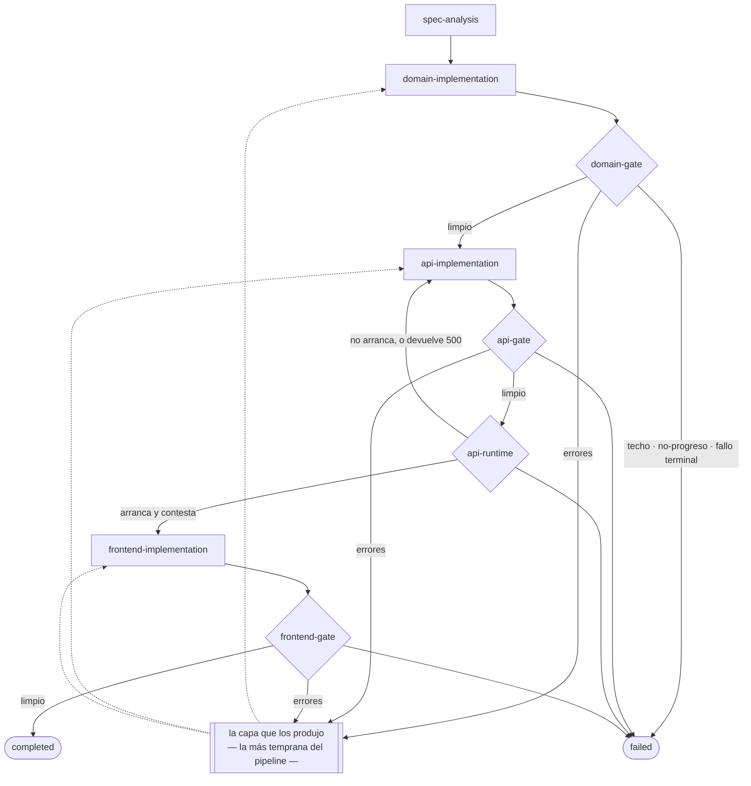

# Orquestador de agentes con LSP y grafos

Toma un spec bajo filosofía **SDD** (Spec-Driven Development) y coordina un grafo de agentes de
Claude Code hasta producir una aplicación web en .NET + React que arranca y sostiene la regla de
negocio que el spec pedía.

Lo que lo distingue de un pipeline de generación de código convencional: **no asume que el código
compiló porque el agente dice que compiló.** Una capa de Language Server Protocol actúa como fuente
de verdad independiente — si devuelve errores, el grafo vuelve al agente de esa capa con los
diagnostics como input; si compila limpio, avanza.

Y lo que el proyecto terminó descubriendo, que vale más que la tesis de arriba: **construir ese gate
es fácil; construir uno que no mienta es todo el trabajo.** Este repo documenta con evidencia
reproducible **nueve formas distintas** en que un gate de este tipo afirma algo falso —ocho de ellas
encontradas corriendo el sistema, no leyendo documentación— y ninguna se manifiesta como un error.
Están en [§4](#4-el-catálogo-de-fallos-silenciosos), que es la sección que conviene leer si solo se
lee una.

---

## Una corrida real, entera

[`docs/evidence/run-20260811-151703.jsonl`](docs/evidence/run-20260811-151703.jsonl), la corrida que
produjo la aplicación entregada. **17 min 52 s, cuatro turnos de agente, ninguna intervención manual:**

| # | Nodo | Qué pasó | Duración |
|---|---|---|---|
| 1 | `spec-analysis` | El spec se descompuso en **14 tareas** — 5 dominio, 5 API, 4 frontend — sin dejar ningún `CA-nn` sin cubrir | 1 min 12 s |
| 2 | `domain-implementation` | El agente de dominio implementa RN-01, RN-02 y RN-03 | 4 min 56 s |
| 3 | `domain-gate` | Roslyn sobre el workspace entero: `total: 0` | 0.7 s |
| 4 | `api-implementation` | Endpoints y persistencia | 5 min 56 s |
| 5 | `api-gate` | 10 diagnostics y **ningún error**: nada de eso bloquea | 4.5 s |
| 6 | `api-runtime` | La app levanta y contesta en **2 rutas** descubiertas por OpenAPI | 38 s |
| 7 | `frontend-implementation` | La interfaz React | 5 min 3 s |
| 8 | `frontend-gate` | `typescript-language-server`: 0 errores | 0.2 s |

```
run-terminated · completed · Every layer passed its gate with no blocking diagnostics.
```

Esa corrida es el camino feliz. **El pipeline se evalúa mejor por el camino infeliz**, y de eso hay
evidencia aparte, versionada en **[docs/evidence/](docs/evidence/)**: la corrida donde un error inyectado
a propósito después del primer turno del agente de dominio vuelve al agente que lo posee y la siguiente
iteración lo corrige; y la corrida anterior a ésta, que **terminó `completed` con una aplicación que
devolvía 500 en la primera request** — el log que miente sin saberlo, y que produjo ADR-017.

## Cómo leer este repo en veinte minutos

El foco declarado del desafío es **el proceso, no el resultado**, así que el registro de decisiones
es parte de lo entregado y no documentación de apoyo. En orden de retorno por minuto invertido:

| Minutos | Qué leer | Por qué |
|---|---|---|
| 0–5 | **[§4 de este README](#4-el-catálogo-de-fallos-silenciosos)** | Las nueve formas en que este gate podía mentir, con la evidencia de cada una |
| 5–10 | **[ADR-017](DECISIONS.md)** y **[ADR-016](DECISIONS.md)** | Las dos decisiones que salieron de correr el sistema entero, no de diseñarlo |
| 10–15 | **[ROADMAP.md](ROADMAP.md)**, historial de los Bloques 4 y 5 | Qué encontró cada bloque, incluida la vez que la verificación misma estaba rota |
| 15–20 | **[`GraphRunner.cs`](src/Orchestrator.Application/Graph/GraphRunner.cs)** y **[`ReviewPolicy`](src/Orchestrator.Domain/GraphPolicy.cs)** | La máquina de estados y la arista condicional, escritas a mano para que se puedan leer |

Los 18 ADR de [DECISIONS.md](DECISIONS.md) están en orden cronológico inverso y cada uno lleva sus
alternativas descartadas con la razón. Los que cambiaron de estado —`Propuesta` → `Aceptada`— llevan
además la sección de verificación que los promovió, con lo que resultó ser falso al contrastarlos con
la realidad.

---

## 1. La arquitectura del grafo

**Máquina de estados escrita a mano, no LangGraph ni Microsoft Agent Framework** ([ADR-003](DECISIONS.md)).
La razón: la máquina de estados *es* lo que se evalúa acá, y delegarla a una librería habría dejado el
proyecto sin su parte interesante. La contrapartida honesta —el grafo es código, no configuración— está
registrada como deuda D3. Y la proporción, que es el argumento menos opinable: **el motor de grafo son
~920 líneas, el 8,9% del código de producción; la capa LSP son 3 887, casi el 40%.** Un framework de
orquestación reemplaza la mitad del 9% y no toca el 40%.



**El destino de la vuelta es la capa más temprana que tenga errores bloqueantes**, no la que acaba
de correr: un error de dominio es muy a menudo la causa del error de API que tiene encima, y
arreglar la API contra un dominio roto es trabajo tirado. El gate de runtime es la excepción y
atribuye siempre a la API, que es la capa dueña del artefacto que no arrancó.

**La arista condicional es lo característico del proyecto**, y su detalle importa: *si el gate devuelve
diagnostics de error, volver al agente de la capa que los produjo* — no al que acaba de correr. Vive en
`ReviewPolicy.Decide`, como función pura, y depende de dos decisiones que parecen de plomería y no lo son:

- **El gate se consulta siempre sobre el workspace entero**, nunca sobre la capa que acaba de trabajar.
  Scopear por capa haría la corrida más prolija y escondería exactamente el caso que el proyecto existe
  para atrapar: el agente de API llamando a un método de dominio que no existe.
- **`LayerMap` atribuye cada diagnostic a una capa por su ruta**, porque el contrato MCP no trae campo
  `layer` a propósito ([ADR-010](DECISIONS.md)). El layout de la app generada es fijo —`src/Domain/`,
  `src/Api/`, `src/Frontend/`— y no lo elige la app: la frontera de capa solo es exigible si el
  orquestador fija los directorios de antemano.
- **Un diagnostic en un archivo que no cae en ninguna capa detiene la corrida**, no se descarta. No hay
  agente al que devolvérselo, así que avanzar sería aprobar código roto. Esa decisión, que parece
  paranoia, es la que casi mata la primera corrida completa — ver [§4](#4-el-catálogo-de-fallos-silenciosos), fila 8.

**Terminación: cuatro vías, todas escritas a mano** porque ningún framework las provee, y todas
obligatorias. Un loop de revisión sin techo contra `claude -p` consume la cuota de 5 h del plan Pro en
una sola corrida ([ADR-001](DECISIONS.md)) — la terminación es una restricción de costo antes que de
elegancia:

| Vía | Cómo se detecta |
|---|---|
| Límite de iteraciones por nodo | `GraphPolicy.MaximumAttemptsPerNode`, comprobado **dos veces**: en `ReviewPolicy`, que frena antes de pagar el turno que ya sabe que es el último, y al entrar al nodo, que es lo que vuelve demostrable la cota |
| No-progreso | El mismo conjunto de diagnostics dos veces seguidas: se compara `DiagnosticSet.Fingerprint()`, independiente del orden |
| Fallo terminal | Un agente que no termina, un plan que no parsea, un diagnostic sin capa dueña |
| **Gate que nunca sale de `indexing`** | La cuarta, que ADR-003 no había enumerado y que el Bloque 2 produjo de verdad. Esperar es obligatorio; esperar sin techo es un cuelgue indistinguible de un servidor muerto |

**`GraphState` es inmutable** y se reemplaza en cada transición. Eso es lo que permite loguear la traza
completa sin copias defensivas, y es lo que hace legible el log de la demo.

**El grafo no sabe que del otro lado hay procesos.** `Orchestrator.Application` conoce `IAgentRunner` e
`ILanguageServerGateway`, interfaces del dominio; podría haber un humano del otro lado. Esa no es una
preferencia de estilo — es lo que permite depurar la máquina de estados sin gastar cuota, y hay tests
de arquitectura que fallan el build si alguien acerca un adaptador real a la suite del grafo.

## 2. La integración LSP

**Por qué LSP y no parsear la salida de `dotnet build`** ([ADR-004](DECISIONS.md)): un compilador
contesta una sola pregunta —¿compila?— y la contesta en texto formateado. Un language server contesta
esa y además *dónde está definido esto*, *quién lo usa*, *qué símbolos hay*, en datos estructurados con
rango, severidad y código. Esas cuatro tools de navegación son lo que permite que **el agente de API
consulte el dominio que no escribió en vez de asumir sus firmas**, y el propio ADR-004 declaró que un
pipeline donde solo se usara `diagnostics` sería su propia falsación.

**El LSP se expone como servidor MCP, no como tool interna** ([ADR-005](DECISIONS.md)), con **dos
consumidores y una sola instancia**: el orquestador, que quiere un veredicto para decidir la arista del
grafo, y los agentes de capa, que quieren navegación durante su turno. Que sea un solo servidor no es
ahorro de procesos: **con instancias separadas el grafo decidiría sobre una realidad que el agente no
comparte.**

```
Orchestrator.Cli
   └── Orchestrator.Lsp ── cliente MCP ──▶ Orchestrator.LspServer  (HTTP, ASP.NET Core)
                                               ├── Microsoft.CodeAnalysis.LanguageServer  (C#)
                                               └── typescript-language-server            (TS/React)
   └── Orchestrator.Agents ──▶ claude -p ──── tools mcp__lsp__* ──▶ (el mismo servidor)
```

Las cinco tools, su transporte y el esquema de `Diagnostic` están en [docs/mcp-contract.md](docs/mcp-contract.md)
([ADR-010](DECISIONS.md)). El campo más importante del contrato entero es **`status: "ready" | "indexing"`**:
un language server recién arrancado devuelve lista vacía mientras indexa, y sin ese campo el gate lee eso
como *compila limpio* y **aprueba código roto**. `"ready"` con lista vacía significa *no hay errores*;
`"indexing"` significa *todavía no sé*. Hacer imposible confundirlos es obligación del contrato, no del
consumidor.

**Roslyn LSP en lugar de OmniSharp** ([ADR-006](DECISIONS.md)), decidido contra la inercia de la
documentación disponible: casi todos los ejemplos de integración LSP con C# apuntan a OmniSharp, que su
propio fabricante dejó en mantenimiento. El paquete no está en nuget.org —vive en el feed público de
Visual Studio, por RID— y tiene dos comportamientos que ningún cliente LSP genérico modela: **no descubre
la solución desde `rootUri`** (hay que mandarle `solution/open`) y **avisa el fin de la carga con
`workspace/projectInitializationComplete`**, que es la señal que vuelve honesto el campo `status`. Sin
ella habría que estimar con un `sleep`, que es precisamente cómo un gate aprueba código roto.

**El cliente LSP es `StreamJsonRpc` con los tipos del protocolo escritos a mano** ([ADR-013](DECISIONS.md)).
El candidato obvio, `OmniSharp.Extensions.LanguageClient`, se descartó con un dato y no con un adjetivo:
**su último release es de septiembre de 2023.** El argumento que cerró la discusión a favor de
`StreamJsonRpc` es que **el propio Roslyn LSP la trae adentro**, así que los dos extremos del pipe hablan
la misma implementación de JSON-RPC.

## 3. La integración con Claude Code

**`claude -p` headless como subproceso, nunca la API de Anthropic** ([ADR-001](DECISIONS.md)). Es una
restricción de costo con consecuencias de diseño en todo el repo: el uso corre contra la suscripción Pro,
cuyo límite de 5 h se agota justo cuando más se necesita —depurando la máquina de estados—, y de ahí sale
que la suite entera corra contra fakes.

**Cuatro subagentes**, versionados en [templates/agents/](templates/agents/) y copiados al `.claude/agents/`
del workspace generado ([ADR-011](DECISIONS.md)):

| Agente | `model` | `maxTurns` | Alcance |
|---|---|---|---|
| `spec-analyzer` | `sonnet` | 15 | Produce el plan. **Sin permiso de escritura**: si pudiera escribir código, la frontera entre planificar y ejecutar se disolvería en el primer turno |
| `domain` | `sonnet` | 40 | Entidades e invariantes |
| `api` | `haiku` | 40 | Endpoints y persistencia |
| `frontend` | `haiku` | 40 | Interfaz React |

`model` es palanca de costo y no de estilo: la API y el frontend son trabajo mecánico sobre un dominio ya
definido; el dominio, donde una interpretación equivocada del spec se paga en las tres capas, se queda en
`sonnet`.

**El alcance de archivos por agente es un hook `PreToolUse`, no una convención del prompt**
([templates/hooks/restrict-to-layer.js](templates/hooks/restrict-to-layer.js)), que rechaza todo `Write` o
`Edit` fuera de `src/<capa>/`. El frontmatter de un subagente **no tiene campo de rutas** — "cada agente
solo toca su capa" no es expresable ahí, y descubrirlo cambió el diseño.

**Y acá está el hallazgo que generaliza todo lo demás: los tres mecanismos de seguridad de esta
integración fallan abiertos.** Un servidor MCP no aprobado, una tool disponible pero sin permiso, un hook
cuyo intérprete no está instalado: **cada uno degrada en silencio a "sin protección", y los tres se ven
exactamente igual que el éxito.** Por eso el orquestador **sondea cada uno al arrancar**
(`AgentEnvironmentCheck`) en lugar de confiarse — incluida la comprobación de que el hook efectivamente
bloquea una escritura fuera de capa. El detalle de los cuatro mecanismos que no funcionaban como estaban
descritos está en la sección de verificación de [ADR-011](DECISIONS.md).

## 4. El catálogo de fallos silenciosos

**Esta sección es el proyecto.** Nueve formas en que este pipeline afirmó —o pudo afirmar— algo falso.
Ninguna se manifestó como un error. **Ocho se encontraron corriendo el sistema**; solo la primera —el
falso verde por indexado— estaba anticipada en el papel, desde el Bloque 0, y es la única que se pudo
diseñar contra ella antes de que ocurriera. Todas tienen hoy su arreglo con test de regresión o su
arnés reproducible.

La distinción que las ordena:

- **Falso verde** — el gate aprueba código roto. Es el modo de fallo que el proyecto entero existe para
  evitar: un gate que aprueba de más es peor que no tener gate, porque a partir de ahí se le cree.
- **Falso rojo** — el gate rechaza código sano. El instinto de *"falla del lado seguro"* lo deja pasar, y
  es igual de grave: gasta turnos pagos rehaciendo trabajo hecho y da por agotado a un agente que estaba
  funcionando.

| # | Modo de fallo | Cómo se ve | Qué lo produce | Dónde vive el arreglo |
|---|---|---|---|---|
| 1 | **Falso verde por indexado** | El gate contesta `total: 0` sobre código que no compila | Un language server recién arrancado devuelve lista vacía mientras indexa | `status: ready\|indexing` en el contrato (ADR-010); `GateEvaluator` espera y reconsulta, con techo |
| 2 | **Falso verde por normalización de rutas** | Un archivo con errores parece limpio | Emitimos `file:///F:/x/a.ts`, `typescript-language-server` contesta sobre `file:///f%3A/x/a.ts`. Como texto son archivos distintos, y los diagnostics quedan archivados bajo una clave que nadie consulta | `WorkspacePaths`: toda conversión pasa por ahí, con test de regresión |
| 3 | **Falso rojo del documento no sincronizado** | El agente corrige el archivo —se ve en disco— y el gate sigue reportando el mismo error. La corrida muere por no-progreso **habiendo progresado** | Un language server contesta sobre el texto que *le dieron*, no sobre el archivo. `didOpen` una vez y nunca más | `DocumentSynchronizer`, con paso 5 en el arnés del Bloque 2 |
| 4 | **Falso verde del archivo que nace después** | El gate contesta `clean` con el error presente en disco | Un archivo creado una vez cargada la solución **no está en el sistema de proyectos**; nadie lo analiza, y eso llega al gate como "compila". **Los agentes crean archivos todo el tiempo** | `workspace/didChangeWatchedFiles` antes del `didOpen` |
| 5 | **Roslyn no falla: se calla** | El servidor deja de contestar todo, para siempre, sin cerrar la conexión ni devolver un error | Cuatro causas distintas a lo largo del proyecto. La más cara: sin `UseSingleObjectParameterDeserialization`, StreamJsonRpc rechaza `workspace/configuration` y Roslyn nunca termina de cargar la solución | `--LspServer:TraceProtocol=true`, que existe exactamente para distinguir *"no lo mandó"* de *"no lo enganchamos"* |
| 6 | **Los tres mecanismos de Claude Code que fallan abiertos** | Un agente que corre, contesta con seguridad y **no tiene acceso al servidor de lenguaje** | Servidor MCP en `pending`, tool disponible pero sin permiso, hook cuyo intérprete no está instalado | `AgentEnvironmentCheck` los sondea al arrancar. La evidencia sale del mensaje `init` de `--output-format stream-json`, que lista tools **antes** de cualquier inferencia |
| 7 | **Cuatro verificaciones en verde y un 500 en la primera request** | Gate de LSP limpio, `dotnet build` en 0, `tsc` en 0, y el agente afirmando que terminó | El agente escribió **C# válido alrededor de una creencia falsa sobre EF Core**. No existe ningún diagnostic para una creencia | El gate de runtime de [ADR-017](DECISIONS.md): un nodo que levanta la app y la ejercita |
| 8 | **La plomería del orquestador dentro del workspace** | Un diagnostic sin capa dueña **mata la corrida**, por culpa del orquestador | `.claude/hooks/restrict-to-layer.js` es un `.js` real que `typescript-language-server` reclama como suyo y que ningún agente puede tocar | `.claude` entre los directorios que el servidor nunca enumera, con test de regresión |
| 9 | **La verificación misma estaba rota — dos veces** | El arnés reportaba `MAL` un punto que sí se cumplía; y después convirtió *"adiviné mal el nombre del campo"* en *"la ruta es otra"* | Leer `blockingSample` —tres items de todo el workspace, ordenados por ruta— como si fuera el resultado de la iteración; y una heurística que daba por buena una lectura del 404 que el handler real desmentía | Lee los contadores de la propia iteración. **Una verificación que falla de más entrena a ignorarla igual de rápido que una que aprueba de más** |

**Los tres que más enseñan, con su detalle:**

**El #7 es el más caro y el que obligó a construir algo que no estaba en el plan.** La primera corrida
completa terminó `Completed`, con las tres capas pasando su gate en la primera pasada, y la aplicación no
funcionaba:

```
The 'HashSet<TareaId>' property 'Tarea._dependencias' could not be mapped
because the database provider does not support this type.
```

En el `DbContext`, con el comentario del agente al lado: *"Para InMemory, EF Core puede manejar
colecciones de tipos value directamente."* **No las maneja.** Cuatro verificaciones independientes decían
que estaba bien. La respuesta es [ADR-017](DECISIONS.md), y su decisión de diseño vale más que el nodo:
**un fallo de runtime es un `Diagnostic`**. Expresado así, `LayerMap` lo atribuye, `ReviewPolicy` le
aplica el techo de intentos y la huella de no-progreso, y el prompt lo transporta — sin una sola arista
nueva en la máquina de estados. El mismo fallo de arranque dos veces detiene la corrida por exactamente
la misma razón por la que lo hace el mismo error de compilación dos veces.

**El #3 y el #4 son el mismo defecto en las dos direcciones**, y solo un loop de revisión real podía
exponerlos: los dos son invisibles para cualquier escenario que lea un archivo una sola vez, que es justo
lo que hacía la verificación manual del Bloque 2. El #4 además se disimula solo —el watcher propio de
Roslyn termina viendo el archivo, así que es una **carrera** y el gate siguiente sí reporta el error—,
que es la peor forma de tener este bug: se arregla lo suficiente como para que nadie lo mire.

**Y el #9 es el que conviene tener presente como categoría.** Dos veces en este proyecto la pieza que
verificaba estaba rota, y las dos veces el error fue del mismo tipo: un atajo cómodo para leer evidencia,
que convertía "no sé" en una afirmación segura. Es la misma familia que las otras ocho, un nivel más
arriba.

**Lo que hay en común entre las nueve, y es la única generalización que este repo se anima a hacer:
ninguna se anuncia.** Todas se ven idénticas al éxito. Por eso el proyecto no confía en ningún mecanismo
que no sondee al arrancar, y por eso cada uno de estos hallazgos tiene un test de regresión o un arnés
reproducible en vez de un comentario en el código.

## 5. Cómo correrlo

**Entorno.** `.NET SDK 10`, `node` y `npm` en el `PATH`, el ejecutable `claude` en el `PATH` —el
orquestador verifica al arrancar que responde y falla rápido si no—, y el feed de NuGet de Visual Studio
declarado en `NuGet.config`, de donde sale Roslyn LSP. `typescript-language-server` **no** hace falta
instalarlo: el orquestador lo restaura en el `node_modules` del workspace generado.

**La corrida completa** — spec de entrada, aplicación generada de cero. **Invoca `claude -p` y gasta
cuota:** ~18 minutos y 4 turnos de agente si todo sale a la primera.

```bash
dotnet run --project src/Orchestrator.Cli -- --spec specs/gestor-tareas.md --output output/
```

`--max-attempts 2` mientras se depura (cada intento extra es un turno pago por capa);
`--trace-protocol` vuelca el tráfico LSP. Códigos de salida: `0` completó, `1` frenó contra un techo,
`2` no arrancó.

**`--no-typescript` no saca la capa de frontend del pipeline: le vacía el gate.** El flag apaga
`typescript-language-server` en el servidor MCP, nada más. `LayerCatalog.InPipelineOrder` sigue siendo
`[Domain, Api, Frontend]`, así que el agente de frontend **corre igual y paga su turno**; lo que cambia
es que nadie produce diagnostics para `src/Frontend`, y su gate pasa por definición. O sea: no ahorra
cuota, y desactiva una verificación sin que nada lo anuncie. Es el mismo falso verde que el proyecto
existe para atrapar, esta vez pedido a mano.

**La aplicación generada, en el navegador.** Son **dos procesos y dos orígenes**: la API no sirve el
frontend. **No gasta cuota.**

```bash
ASPNETCORE_ENVIRONMENT=Development dotnet run --project output/src/Api   # http://localhost:5000
cd output/src/Frontend && npm run dev                                   # http://localhost:5173  (otra terminal)
```

En **PowerShell** (`&&` no existe en 5.1, y la variable de entorno no se antepone al comando):

```powershell
$env:ASPNETCORE_ENVIRONMENT = "Development"; dotnet run --project output/src/Api
cd output/src/Frontend; npm run dev
```

`ASPNETCORE_ENVIRONMENT=Development` no es opcional: la API solo habilita CORS bajo
`app.Environment.IsDevelopment()` (regla 7 de `templates/agents/api.md`), y sin `launchSettings.json`
—prohibido a propósito, porque un perfil de arranque fijaría la dirección y le ganaría al orquestador
(regla 9)— el entorno por defecto de .NET es `Production`. Arrancarla pelada dejaría CORS apagado
sin ningún aviso: la API sigue contestando `200` a todo, y **la pantalla queda vacía** — el mismo
síntoma que si CORS nunca se hubiera implementado, un fallo que ningún gate de compilación puede ver,
de la misma familia que los de [§4](#4-el-catálogo-de-fallos-silenciosos).

Que la API quede en `:5000` es el default de Kestrel, no una dirección elegida — y el frontend generado
la tiene hardcodeada en `App.tsx` porque hoy no tiene otra forma de encontrarla (D20 en `ROADMAP.md`).
Si el puerto 5000 estuviera ocupado por otro proceso, la API arrancaría en otro puerto igual de
silenciosamente y el frontend quedaría apuntando a la nada.

**La verificación de que la app hace lo que el spec pedía** — la parte que el gate **no puede** contestar,
porque verifica compilación y no corrección. Levanta la app generada y comprueba **por HTTP** que CA-06 y
CA-08 se sostienen: crea dos tareas, declara la dependencia, intenta completar la bloqueada, y verifica
que se rechace, que el error nombre al prerrequisito y que el estado no haya cambiado. **No gasta cuota**
y tarda segundos.

```bash
dotnet build output/App.slnx
dotnet run --project src/Orchestrator.GeneratedAppVerification
```

Las rutas van por argumento (`--complete /api/tareas/{id}/cerrar`) porque **el spec no nombra endpoints a
propósito**: los elige el agente de API, corrida a corrida. El arnés imprime todos los intercambios HTTP
para que una ruta equivocada se distinga de una invariante rota — que es exactamente la distinción que el
propio arnés se equivocó una vez (fila 9 de arriba).

**Las verificaciones manuales**, fuera de la suite porque arrancan cosas reales:

```bash
dotnet run --project src/Orchestrator.LspServer.ManualVerification   # language servers reales
dotnet run --project src/Orchestrator.PipelineVerification           # gasta cuota: el loop de revisión
```

**Si algo quedó vivo** — un language server huérfano bloquea el `bin/` del próximo build y mantiene
handles sobre `output/`:

```bash
powershell.exe -ExecutionPolicy Bypass -File tools/kill-language-servers.ps1
```

Las dos partes de ese comando son cicatrices, no ceremonia: `pwsh` no está instalado en la máquina de
desarrollo (lo descubrió el Bloque 4, porque un hook que lo invocaba falló en silencio) y la política de
ejecución rechaza el script sin el flag (lo descubrió el Bloque 5, al necesitarlo). Es el mismo patrón dos
veces: **la red de seguridad documentada no era ejecutable, y solo se nota el día que hace falta.**

## 6. Cómo se testea

```bash
dotnet test src/Orchestrator.slnx    # sin red, sin `claude`, sin language servers
```

**Ninguna suite invoca la CLI real ni arranca un language server real** — y eso no es preferencia de
estilo, es [ADR-001](DECISIONS.md) aplicado: el límite de 5 h del plan Pro se agota depurando la máquina
de estados. La verificación es literal, no asumida: **la suite se corre con `claude` fuera del `PATH`.**

La decisión que sostiene todo lo demás ([ADR-014](DECISIONS.md)): **los dos fakes comparten un
`FakeWorkspace`.** Guionar el agente y el gate por separado es la forma obvia y es una trampa —los dos
guiones pueden contradecirse, así que un test puede pasar describiendo una corrida imposible: un agente
que "arregló" algo que el gate nunca vio roto—. Con un escenario compartido, `FakeAgentRunner` muta el
workspace y `FakeLanguageServer` reporta lo que hay adentro: **el grafo converge porque el agente reparó
algo**, y *"el agente no cambió nada"* deja de ser un veredicto guionado y pasa a ser la definición
literal del test de no-progreso.

Hay además **tests de arquitectura** que fallan el build si aparece una implementación de `IAgentRunner`
fuera de `Orchestrator.TestSupport`, o si la suite del grafo llega a referenciar `Orchestrator.Agents`:
un `ProjectReference` agregado por comodidad dejaría al runner real a un `new` de distancia de un test, y
eso se comería la ventana de 5 h.

**Una sola excepción, acotada y dicha:** `Orchestrator.Agents.Tests` lanza `node`, y por eso su tanda
tarda segundos en vez de milisegundos. Es la única forma de testear el hook de alcance de archivos como
lo que es —un script cuyo único comportamiento interesante es su código de salida—. Lo que la regla
prohíbe es `claude -p` y los language servers reales; `node` no es ninguno de los dos.

## 7. El output

La aplicación generada vive en **su propio repositorio, `gestor-tareas-generado`**, presentada
explícitamente como *output del orquestador y no trabajo manual* ([ADR-008](DECISIONS.md)) — su README es
el único archivo escrito a mano de ese repo, y lo dice en la primera línea. Dos repos y no uno, porque meterlas juntas
vuelve ambiguo qué escribió una persona y qué escribió un agente — que es precisamente la pregunta que un
evaluador se hace.

En este repo, `output/` está gitignoreado y **es desechable por construcción**: se borra y se regenera de
cero en cada corrida. Si alguna vez hiciera falta editar algo ahí a mano para que el pipeline avance, eso
es un bug del orquestador y no un atajo aceptable.

El artefacto es un **gestor de tareas con dependencias** ([ADR-009](DECISIONS.md)), elegido contra la
alternativa cómoda de un CRUD: **un CRUD sin lógica se genera bien aunque el grafo, el loop de revisión y
el gate estén rotos**, así que una corrida exitosa no probaría nada. La invariante RN-01 —no se completa
una tarea con prerrequisitos abiertos— toca las tres capas, lo que la vuelve el test de aceptación del
pipeline entero y no solo de la app.

## 8. Lo que no hace

Deudas conscientes, todas registradas con su trigger en [ROADMAP.md](ROADMAP.md). Las que más importarían
si el proyecto siguiera:

- **No hay gate de comportamiento** (D4, D16). El gate de runtime comprueba que la app arranca y contesta,
  no que se comporte; que sostenga RN-01 se verifica desde afuera, con `GeneratedAppVerification`. El paso
  natural es que ese arnés se vuelva un nodo más del grafo.
- **El gate de runtime es solo de la API** (D17): no hay nodo `frontend-runtime`. De esa capa se sigue
  sabiendo únicamente que compila. Es lo que quedó abierto de un fallo real —el frontend generado
  compilaba y **no se podía abrir**, porque el esqueleto no traía bundler— que se cobró el 13/08 poniendo
  Vite en el scaffold. La lección generaliza la fila 7 de arriba: **el gate pregunta lo que se le enseñó a
  preguntar**, y durante cinco bloques a esta capa solo se le preguntó si compilaba.
- **Sin persistencia de corridas** (D1): una corrida interrumpida se reinicia desde cero.
- **Sin paralelismo entre capas** (D2): el grafo es estrictamente secuencial.
- **Volver a una capa anterior re-invoca también a las posteriores** (D9), aunque su código no haya
  cambiado. Arreglarlo requiere saber qué archivos tocó cada agente, que hoy el grafo no sabe.
- **El CLI corre desde el repositorio, no desde una instalación** (D14).
- **`workspaceSymbol` en frío no distingue "todavía no indexé" de "no existe"** (D7). El gate no usa esa
  tool, así que no bloquea el pipeline.

## Documentación

| Documento | Contenido |
|---|---|
| [DECISIONS.md](DECISIONS.md) | Los 18 ADR — qué se decidió, por qué, y qué alternativas se descartaron con su razón |
| [ROADMAP.md](ROADMAP.md) | Los seis bloques con su criterio de salida verificable, riesgos y deudas |
| [AI.md](AI.md) | Referencia técnica: arquitectura, reglas de oro, convenciones, anti-patrones prohibidos |
| [CLAUDE.md](CLAUDE.md) | Instrucciones de comportamiento para Claude Code **en este repo** |
| [specs/gestor-tareas.md](specs/gestor-tareas.md) | El spec SDD de entrada |
| [docs/mcp-contract.md](docs/mcp-contract.md) | Las cinco tools del servidor MCP, con firmas y ejemplos |
| [docs/prompts/](docs/prompts/) | Un prompt de arranque por bloque, escrito al cerrar el anterior |
| [templates/](templates/) | Lo que el orquestador inyecta en el workspace generado: subagentes, hook, `CLAUDE.md` de la app y el esqueleto de la solución |
| [orquestador-agentes-briefing.md](orquestador-agentes-briefing.md) | El briefing original del desafío. Registro de origen, no se edita |

> **Ojo con los dos `CLAUDE.md`.** El de la raíz son instrucciones para Claude Code cuando **construye el
> orquestador**. [`templates/generated-app-CLAUDE.md`](templates/generated-app-CLAUDE.md) es un
> **artefacto de runtime**: la plantilla que el orquestador inyecta en el workspace de la app generada
> para acotar el scope de los subagentes de capa. Tienen el mismo nombre y confundirlos es un error
> conceptual, no un descuido de nombres.
